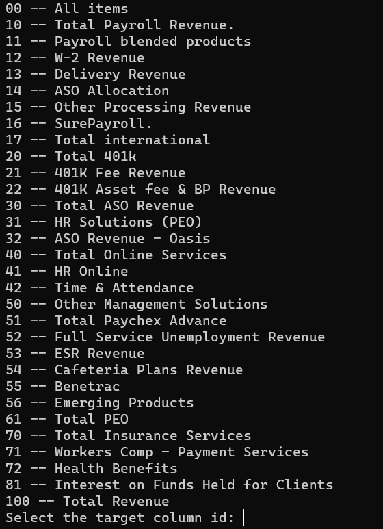

# Paychex Revenue Forecast

## Objective

Establish revenue forecast model including:

    - relevant drivers
    - any correlated variables
    - summary output

## Data Architecture

For now the project is configured to run and save all the outputs locally, but it can be setup to any other location.


## Project Structure

```text
project
│  README.md
│  requirements.txt
│  credentials.yml
│  run_analysis.py
├───data                     # the data directory
│   ├───clean
│   ├───dictionary
│   ├───external
│   ├───figures
│   ├───metadata
    ├───models
│   ├───predictions
│   └───raw
├───docs                    # documentation of the problem
├───imgs
├───notebooks               # experimentation and exploration notebooks
└───src                     # Source code


```

## Set up

The enviroment configuration can be done with *Pip* or *Conda*. Although doing it with Conda is recommended.

### Conda

1. Create a new enviroment with Python 3.8
```commandline
conda create --name <env_name> python=3.8
```

2. Go to the new enviroment.
```commandline
conda activate <env_name>
```
3. Install dependencies located in the requirements.txt file.
```commandline
pip install -r requiements.txt
```

### Pip

1. Make sure you have installed Python 3.8.
2. Install dependencies located in the requirements.txt file.
```commandline
pip install -r requirements.txt
```

## Running the Model Training and Predictions process.

1. Place all the files in the `./data/raw` folder.
2. Open a command shell and go to the project folder.
3. Process the raw data to get a clean table with the `clean_data.py`script using the next line.
```commandline
python src\paychex_ml\clean_data.py
```
4. Update the external data with the `external_data.py` script using the next command:
```commandline
python src\paychex_ml\external_data.py
```
5. Run the models using the script `run_analysis.py` with the next command:
```commandline
python run_analysis.py
```
The models can be run also using the notebook `./notebooks/full_analysis_modular.ipynb`
6. You will be asked to choose the line to run. Choose one of the options:




7. The results will be saved in the `./data/`, and it includes:
- Predictions for the forecast window selected in a parquet file `./data/predictions/<date>`
- Best ML model and UTS model in a pickle file `./data/models/<date>`
- Correlations, feature importance and predictions plots. Saved in `./data/figures/<date>`
- Metadata that includes the models trained and the *MAPE*. Saved in `./data/metadata`